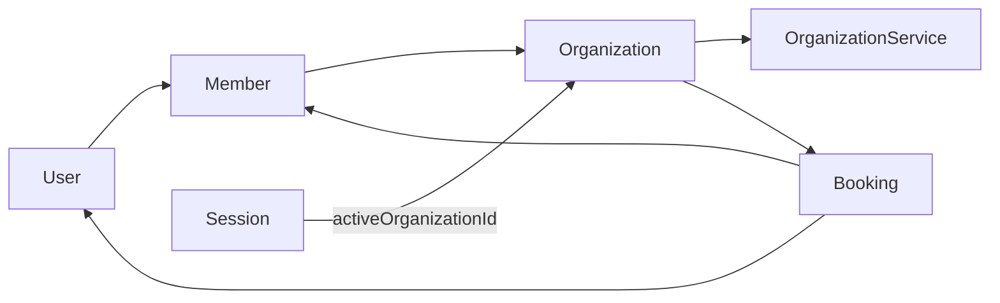

# Better Auth com Organizations

Guia operacional da autenticação e do multi-tenant no France Barbershop.

## Objetivo

Centralizar autenticação com **Better Auth** e modelar cada barbearia como uma **Organization** (plugin `organization`). O tenant concentra identidade pública e dados de negócio — não existe tabela `Barbershop` separada.

## Arquitetura adotada



| Conceito | Implementação |
| --- | --- |
| **Tenant / barbearia** | `Organization` (nome, slug, logo, endereço, telefones, descrição) |
| **Equipe** | `Member` — vínculo `User` ↔ `Organization` com papel por org |
| **Barbeiro** | `Member` com `role: MEMBER` e `User.role: MEMBER` |
| **Dono / gestor** | `Member` com `role: OWNER` ou `MANAGER`; `User.role` espelha o papel global |
| **Cliente** | `User.role: CLIENT` (sem `Member` obrigatório) |
| **Sessão ativa** | `session.activeOrganizationId` (definido no login e via switcher) |
| **URL pública** | `/{slug}` → `Organization.slug` |

### Papéis em dois níveis

O sistema usa **dois eixos** de autorização:

1. **`User.role`** (global) — controla acesso ao painel (`/panel`) e o layout exibido.
2. **`Member.role`** (por organização) — controla o papel do usuário dentro de cada barbearia.

Papéis definidos no access control (`src/shared/lib/permissions.ts`):

| Papel | Uso típico |
| --- | --- |
| `CLIENT` | Cliente final; agenda serviços na área pública |
| `MEMBER` | Barbeiro; vê dashboard e agendamentos da sua org |
| `MANAGER` | Gestor com permissões de gestão no painel |
| `OWNER` | Dono da barbearia; gestão completa + assinatura Stripe |
| `ADMIN` | Reservado no access control da plataforma |

### Teams

O schema Prisma inclui `Team` e `TeamMember` (legado do plugin), mas **teams não estão habilitados** na configuração atual do Better Auth (`organizationClient()` sem `teams`). Não há fluxo de UI nem queries de negócio que usem teams hoje.

## Arquivos implementados

### Servidor — autenticação

| Arquivo | Responsabilidade |
| --- | --- |
| `src/shared/lib/auth.ts` | Better Auth: e-mail/senha, Google, verificação, reset, plugin `organization`, convites via Resend |
| `src/shared/lib/permissions.ts` | Access control (`ac`) e papéis ADMIN, OWNER, MANAGER, MEMBER, CLIENT |
| `src/shared/lib/auth-client.ts` | Cliente React: `signIn`, `signUp`, `organization.setActive`, `useActiveOrganization` |
| `src/server/auth/users.ts` | `getCurrentUser()`, `signIn`, `signUp` |
| `src/app/api/auth/[...nextauth]/route.ts` | Handler HTTP do Better Auth (nome de rota legado) |

### Servidor — organizações e membros

| Arquivo | Responsabilidade |
| --- | --- |
| `src/features/organization/organization.actions.ts` | `createOrganizationWithProfile`, `getOrganizations`, `getOwnerByUserId`, etc. |
| `src/features/organization/organization.service.ts` | Regras de negócio de organizações |
| `src/features/member/member.actions.ts` | `addMember`, `sendInvitationMember` |
| `src/features/member/member.panel.actions.ts` | `createBarberOwner` e actions do painel |
| `src/app/api/accept-invitation/[invitationId]/route.ts` | Aceite de convite por GET → redirect para `/panel` |

### Autorização no domínio

| Arquivo | Responsabilidade |
| --- | --- |
| `src/shared/guards/get-organizations-for-owner.ts` | Organizações onde o usuário é `Member.role: OWNER` |
| `src/shared/guards/get-barber-member-for-user.ts` | Registro `Member` do barbeiro (`role: MEMBER`) |
| `src/shared/guards/require-organization-for-owner.ts` | Garante que o owner tem acesso à org antes de mutações |
| `src/shared/guards/panel/organization-query.ts` | Resolução de `?organizationId=` no painel multi-org |

### UI

| Arquivo | Responsabilidade |
| --- | --- |
| `src/components/auth/create-organization-form.tsx` | Formulário de criação de barbearia |
| `src/components/auth/organization-switcher.tsx` | Troca de organização ativa no header do painel |
| `src/components/emails/organization-invitation.tsx` | Template de e-mail de convite |
| `src/app/(authenticated)/panel/organization/page.tsx` | Gestão de organizações e membros |
| `src/app/(authenticated)/panel/layout.tsx` | Layout do painel por papel (OWNER/MANAGER vs MEMBER) |
| `src/proxy.ts` | Proteção de `/panel/:path*` — sessão + OWNER, MANAGER ou MEMBER |

### Schema

`prisma/schema.prisma` — modelos `User`, `Session`, `Account`, `Verification`, `Organization`, `Member`, `Invitation`, `Team`, `TeamMember` e entidades de negócio (`OrganizationService`, `Booking`, horários, etc.).

## Fluxos

### 1. Criar barbearia (owner)

```
Owner autenticado → /panel/organization → "Criar organização"
  → createOrganizationWithProfile()
    → Organization (name, slug, logo, address, phones, description)
    → Member (userId, organizationId, role: OWNER)
    → User.role: CLIENT → OWNER (se aplicável)
    → auth.api.setActiveOrganization()
```

O slug deve ser único, em minúsculas com hífens (`barbearia-vintage`). A página pública fica em `/{slug}`.

### 2. Convidar membro por e-mail

```
Owner → sendInvitationMember(email, role, organizationId)
  → auth.api.createInvitation()
  → sendInvitationEmail() em auth.ts
  → E-mail Resend com link: /api/accept-invitation/{invitationId}
```

O convidado precisa estar autenticado (ou autenticar-se) ao clicar no link. Em sucesso, redireciona para `/panel`; em falha, para `/not-authenticated`.

### 3. Adicionar barbeiro existente

Fluxo alternativo em `createBarberOwner()` (`src/features/member/member.panel.actions.ts`):

1. Owner informa e-mail de um usuário já cadastrado.
2. Sistema valida que o usuário não é barbeiro em outra org.
3. Cria `Member` com `role: MEMBER` e atualiza `User.role` para `MEMBER`.

### 4. Trocar organização ativa

No painel, o `OrganizationSwitcher` chama:

```ts
await authClient.organization.setActive({ organizationId })
router.refresh()
```

A sessão passa a usar o novo `activeOrganizationId`.

### 5. Sessão no primeiro login

Hook em `src/shared/lib/auth.ts` (`databaseHooks.session.create.before`):

- Busca o primeiro `Member` do usuário via `getActiveOrganization(userId)`.
- Preenche `activeOrganizationId` na sessão criada.

> Se o usuário pertencer a várias organizações, o switcher no painel é a forma de alternar o contexto.

## Convenções

### Slug e URL pública

- `Organization.slug` — único, estável, usado em `/{slug}` e em links da sidebar.
- `Organization.name` / `logo` — marca exibida na UI pública e no painel.

### Escopo no painel (`organizationId`)

Rotas de gestão do owner aceitam `?organizationId=` quando o usuário possui mais de uma organização. Helpers em `src/shared/guards/panel/organization-query.ts`:

- `resolveScopedOrganizationIdOrRedirect` — força seleção de org ou redireciona com query param.
- `resolveOrganizationIdForAggregate` — dashboard/agenda agregados (`all` ou org específica).

Barbeiros (`MEMBER`) usam a org do seu único `Member` via `ensureBarberShopIdMatchesUrl`.

### Barbeiro ativo para agendamento

`Member.isActive` controla se o barbeiro aparece na página pública para novos agendamentos (`toggleBarberActiveOwner`).

## Isolamento multi-tenant

Práticas já adotadas:

- Queries do owner passam por `requireOrganizationForOwner` ou `getOrganizationsForOwner`.
- Barbeiro resolve org via `getBarberMemberForUser` (um `Member` com `role: MEMBER`).
- Bookings referenciam `memberId` (barbeiro) e `serviceId` (`OrganizationService` da org).
- Serviços, horários, pausas e bloqueios são sempre filtrados por `organizationId`.

Pontos a reforçar (ver roadmap):

- Garantir filtro por org em **todas** as Server Actions restantes.
- Alinhar suporte completo a `MANAGER` nas queries de `getOwnerByUserId` (hoje filtra só `Member.role: OWNER`).

## Variáveis de ambiente

Obrigatórias para auth e convites:

```env
BETTER_AUTH_SECRET="..."
BETTER_AUTH_URL="http://localhost:3000"
DATABASE_URL="postgresql://..."
RESEND_API_KEY="re_..."
EMAIL_NO_REPLY="France Barber <no-reply@seudominio.com>"
```

Opcionais:

```env
GOOGLE_CLIENT_ID="..."
GOOGLE_CLIENT_SECRET="..."
```

Convites são enviados **diretamente pelo Resend** em `sendInvitationEmail` — não há webhook de convite configurável no código atual. A URL de aceite é montada em runtime:

```
{BETTER_AUTH_URL}/api/accept-invitation/{invitationId}
```

## Migração Prisma

Para alterações no schema em ambiente com dados:

1. `npx prisma validate`
2. `npx prisma format`
3. `npx prisma migrate diff` — revisar SQL antes de aplicar
4. Aplicar em staging antes de produção

Ver também `.cursor/rules` e skills Prisma do projeto.

## Desenvolvimento local

Em `NODE_ENV=development`, a rota `/dev` permite vincular o usuário logado como `OWNER` de uma organização existente (`setCurrentUserAsOwner`). Útil quando o seed cria organizações sem contas de e-mail/senha.

## Roadmap

- [x] Fluxo completo de convite → aceite → primeiro acesso do barbeiro
- [x] Webhook Stripe para sincronizar status de assinatura
- [ ] Suporte consistente a `MANAGER` nas queries de organização do painel
- [ ] Habilitar teams no plugin (se necessário para segmentação interna)
- [ ] Auditoria de isolamento: todas as actions filtram por `organizationId`
- [ ] Webhook ou job para sincronizar papéis `User.role` ↔ `Member.role` após convite

## Referências

- [README do projeto](../README.md)
- [Better Auth — Organization plugin](https://www.better-auth.com/docs/plugins/organization)
- Regras do projeto: `.cursor/rules/middleware.mdc`, `.cursor/rules/nextjs-server-actions.mdc`
